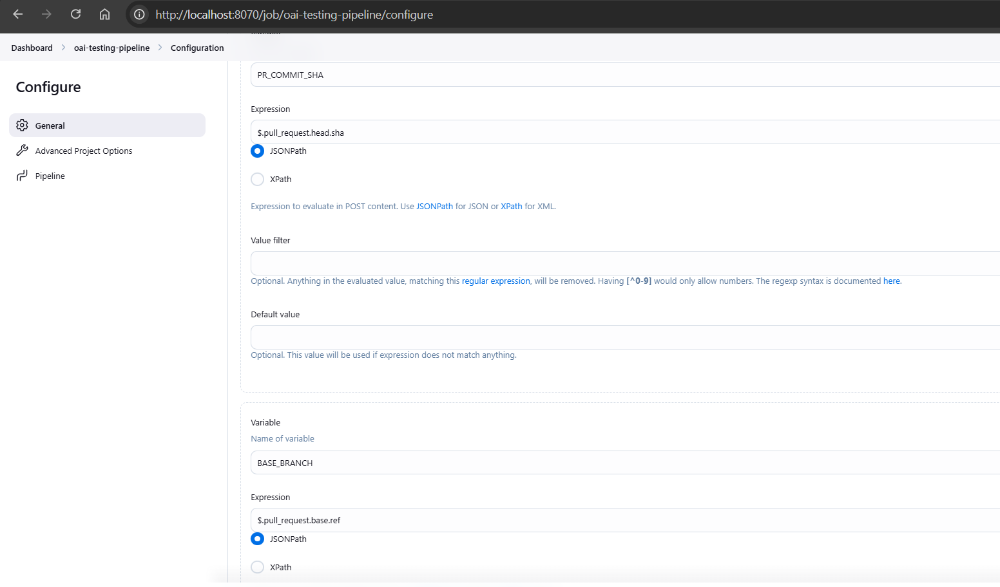
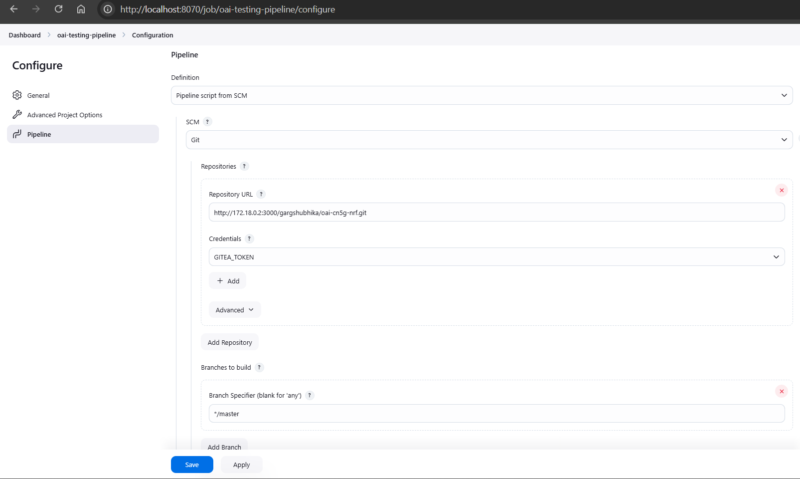

1. We created a dedicated [Dockerfile](../Files/Dockerfile) because we wanted to use the Jenkins container itself as the agent so we needed to install docker and sudo and also, have the right permissions to run sudo.
2. Build the docker image
   
   `docker build  --no-cache -t jenkinsdockerfile .`
   
   
3. We run the Jenkins using the below command:
`   
docker run --name jenkins-new31 -d \
-p 8070:8080 \
-p 50000:50000 \
-v /var/run/docker.sock:/var/run/docker.sock \
-v jenkins_home:/var/jenkins_home \
jenkinsdockerfilecurl
`
4. Connect the Jenkins container to our network:
   
   `docker network connect gitea_default`
   
   ` docker network connect gitea_default e17c92353178`

5. Access Jenkins using the below URL, and the username is `admin`
   
   [http://localhost:8070](http://localhost:8070)
   
6. To get the initial password, I ran the below command
   
   `docker exec -it CONTAINER_ID cat /var/jenkins_home/secrets/initialAdminPassword`

   
## Initial setup

Install the below plug-ins:

Go to Manage Jenkins > Manage Plugins.

- **Blue Ocean**:  
  UI for Jenkins to visualize delivery pipelines.
- **Checks API**:  
  Checks on GitHub and similar platforms.
- **Credentials Plugin**:  
  To manage credentials for use in Jenkins jobs.
- **Dashboard for Blue Ocean**:  
  To enhance the Blue Ocean dashboard experience.
- **Display URL for Blue Ocean**:  
  Generate sharable Blue Ocean links for builds and pipelines.
- **Generic Webhook Trigger Plugin**:  
  To trigger Jenkins jobs on webhook calls.
- **Git**:  
  For Git version control support for Jenkins.
- **Git Pipeline**:  
  Adds Git features for pipeline jobs.
- **Gitea Checks**:  
  Enables Gitea code checks in Jenkins.
- **Gitea**:  
  Integrates Gitea repositories with Jenkins.
- **Web for Blue Ocean**:  
  Additional web tools for Blue Ocean.
- **Pipeline: Groovy**:  
  Groovy language support for pipeline scripts.
- **Pipeline: Declarative**:  
  To simplify pipeline creation with a declarative syntax.
- **Pipeline: Job**:  
  Allows pipelines to define and run jobs.
- **Pipeline: SCM Step**:  
  Enables pipelines to check out source code from SCM.
- **HTTP Publisher**:  
  To publish artifacts to HTTP/HTTPS servers.
- **HTTP Request**:  
  To make HTTP requests from Jenkins pipelines.

The following parameters were used to configure Jenkins, the pipeline and the connection to Gitea.

Make sure we have the [Jenkinsfile](../Files/Jenkinsfile) in the added path of the above config.

### References
- [https://plugins.jenkins.io/ui/search/?query=](https://plugins.jenkins.io/ui/search/?query=)
   
   
